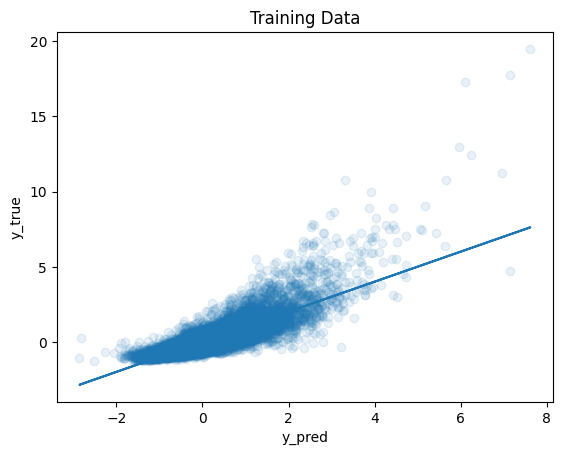
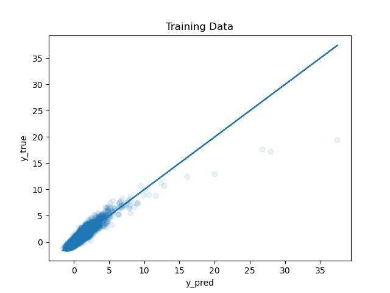

# Exponential Regression
## About
I built this whole model from scratch including assuming the exponential function and deriving gradient function to applying it in the algorithm, after seeing Linear model incapable of handling the task.
## Comparision
#### Linear Model
I saw problems while applying a linear regression model with this perticular dataset.I plotted y_true aginst y_predicted for the training data set after the model training. In ideal case that must be symmetric from the line mostly lying over the line,but here the plot was somewhat curved upwards as shown in the image bellow.  

  
  
Linear Regression Plot

  
The loss(Mean Squared Error) for linear model over standardised test data was coming out to be around <b>0.35</b>

#### Exponential Model
  
So I assumed a function as <b>eXA+c</b> (here matrix X is along with a bias column of 1).  
Then after deriving the gradient for this function and applying it in my algorithm I achieved a better graph for the same as shown bellow.  

  
  
Exponential Regression Plot

Although for higher values of predicted prices there is still deviation since the true relation may not even be exponential and maybe a higher degree polynomial function, but assuming the exponential function reduced the test lost to <b>0.11</b>
