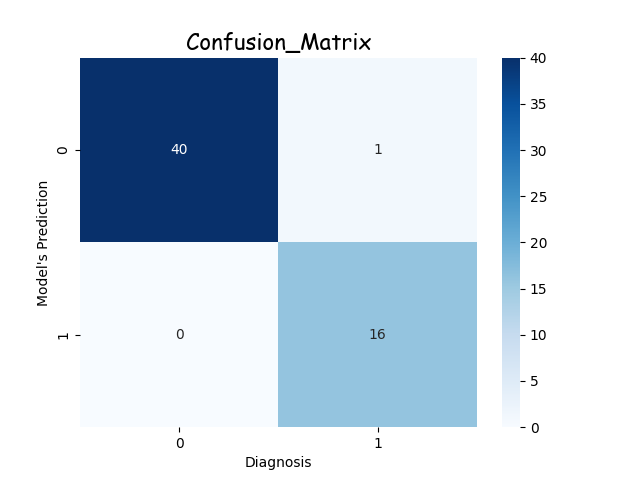

# Logistic-Regression-Algorithm from Scratch

This is my first logistic regression program, where I built the whole algorithm from scratch. The aim was to predict the probability of having breast cancer based on various features like radius mean, area mean, texture mean, etc.

## Features of Program
1. For training algorithm accepts numpy array input in the sequence of x_train and y_train.
2. Binary Label encoder is also provided in algorithm as a function Encoder() which can be imported and used if neccesary.
3. After training the algorithm can provide an output predicted array containing binary values or can provide probability array containing the probabilities of events which can be used for calculation logloss.
4. The model contains LogLoss and Confusion Matrix functions which can be imported and used by the names logloss() and Confusion_Matrix().

## Model Accuracy
On the breast cancer data the model provides an **Log Loss** value of **0.0684**, with the following Confusion Matrix.  

 

 

Which gives:  
Sensitivity= **94.1%**  
Specificity= **100%**

## To use the Program
- Clone the Repository
- Make sure you have the following libraries: Numpy,Pandas,MatplotLib,Seaborn,Imbalanced-Learning,Sckit-Learn
- Run the program
- For testing over your own custom data make a numpy array of your dataset in the sequence of the training data frame and use model.predict(custom_data) in a new cell of Jupyter Notebook and run the program.